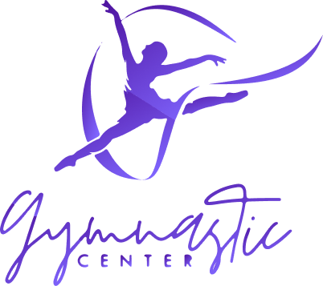

<p align="center">
  <a href="https://github.com/OmegaTeamUCAB/gymnastic-center-backend/tree/main" target="blank"></a>
</p>

# Gymnastic Center Backend

This is a project for the Software Development subject at the Andrés Bello Catholic University.

In this repository you can find a fitness life course application built with NestJS and other technologies.

## Architechture 

Different software development practices were applied in our application:

- **Hexagonal Architechture:** Through this architecture we can decouple the business logic from its implementation details.

- **Aspect Priented Programming (AOP):** Through the different aspects implemented we can cover the orthogonal functionalities or cruss-cutting concerns presents in the application.

- **Domain Driven Design (DDD):** This approach allows us to model the logic of our application as closely as possible to the reality of the problem domain.

- **Command Query Responsability Segregation (CQRS):** This pattern allows us to separate read operations (Queries) from write operations (Commands). This is in order to maximize performance, scalability and security in our application.

- **Event Sourcing:** This pattern allows us to store all the events that occur in our application in order to be able to reconstruct the state of the application through their reproduction.

## Tools

<p align="left"> 

  <a href="https://nestjs.com/" target="_blank" rel="noreferrer">  
  </a>
  <a href="https://www.mongodb.com/" target="_blank" rel="noreferrer">  
  </a>
  <a href="https://www.firebase.google.com/" target="_blank" rel="noreferrer">  
  </a>
  <a href="https://www.rabbitmq.com/" target="_blank" rel="noreferrer">  
  </a>
  <a href="https://www.algolia.com/" target="_blank" rel="noreferrer">  
  </a>
  <a href="https://www.docker.com/" target="_blank" rel="noreferrer">  
  </a>
  <a href="https://cucumber.io/" target="_blank" rel="noreferrer">  
  </a>
</p>

- **[NestJs](https://nestjs.com/):** Used as backend framework
- **[MongoDB](https://www.mongodb.com/):** Used for the implementation of the different read models and the event store.
- **[Firebase](https://firebase.google.com/):** Used for handling notifications within the application..
- **[RabbitMQ](https://www.rabbitmq.com/):** Used to implement a message queue in charge of synchronizing the different read models with the event store.
- **[Algolia](https://www.algolia.com/):** Used as a search engine and an IA tool for the recomendations.
- **[Docker](https://www.docker.com/):** Used to generate the image and containers needed to run the application.
- **[Cucumber](https://cucumber.io/):** Used to make the unit tests in the application.

## Documentacion

- **Application Diagram:**

  <a href="https://github.com/OmegaTeamUCAB/gymnastic-center-backend/tree/main" target="blank"></a>

- **Domain model:**

  <a href="https://github.com/OmegaTeamUCAB/gymnastic-center-backend/tree/main" target="blank"></a>


- **API Hexagonal Architechture diagram:**

  <a href="https://github.com/OmegaTeamUCAB/gymnastic-center-backend/tree/main" target="blank"></a>


- **API URL:** [Gymnastic Center Api](https://api-rswna.ondigitalocean.app)

- **API Documentation:** [Api Documentation](https://api-rswna.ondigitalocean.app/docs)

## Getting Started

1. Clone the repository.

2. Rename the ```.env.template``` file to ```.env```.

3. Asign the enviroment variables in the ```.env``` file.

## Running the app
```
npm start
```

## Running the tests 
```
npm run test
```

## Omega Team

We are a team of developers characterized by offering quality software solutions following the best software development practices.

Our team is conformed by:

- [Carlos Fornari](https://github.com/cdfornari)
- [Luis Elian Montes](https://github.com/luiselianm)
- [José Pérez](https://github.com/joseeg-perez)
- [Luis Díaz](https://github.com/Nannd0u)
